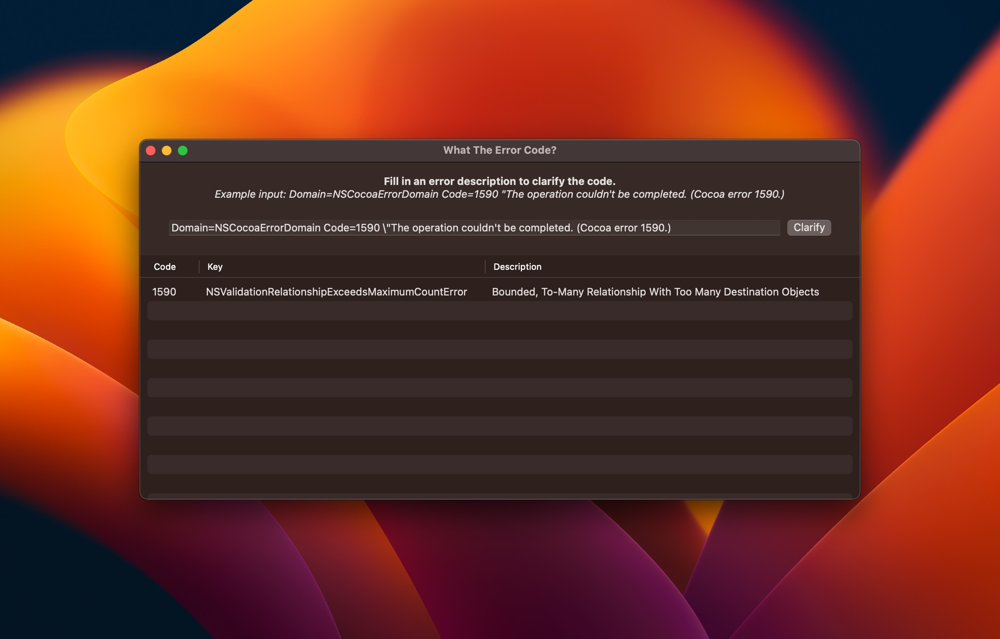

# What *is* The Error Code?
Received an error like:

```
Domain=NSCocoaErrorDomain 
Code=1590 \"The operation couldn't be completed. (Cocoa error 1590.)
```

And you have no clue what the code means? Use this app to find a description:



## Supported error domains
- [x] `NSCocoaErrorDomain`
- [ ] `NSURLErrorDomain`

## Can I help contribute?
Yes, please! Feel free to open a PR and add new error descriptions to [this JSON file](Sources/WhatTheErrorCode/errors.json).

### Using ChatGPT to generate JSON
ChatGPT has been a great help in creating JSON output from header files like [this one](https://gist.github.com/krin-san/eb5cc692dcce9f2034bc8961cfc58694). I've used the following prompt:

```
Create a JSON array of the following input and use property names key, code, and description: 
"
NSPersistentStoreTimeoutError                    = 134090, // failed to connect to the persistent store within the specified timeout (see NSPersistentStoreTimeoutOption)
NSPersistentStoreUnsupportedRequestTypeError	 = 134091, // an NSPersistentStore subclass was passed an NSPersistentStoreRequest that it did not understand
"
```

## I just want to use the app and keep it up to date with the latest errors
Download [RocketSim](https://www.rocketsim.app) and use it from the Menu Bar. *(Coming in version 10.1)*

## Author
This library is created by [Antoine van der Lee](https://www.twitter.com/twannl) after [getting enough likes](https://twitter.com/twannl/status/1636429057934909442).

## License

WhatTheErrorCode is available under the MIT license. See the LICENSE file for more info.